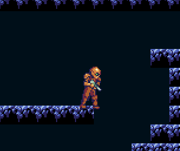

# METROIDVANIA

a platformer/action-exploration game in Lua (using LOVE)



### run instructions

put all these files in a folder, say 'metroidvania'. drag and drop the folder into a running LOVE window, or run 

``` love metroidvania ```